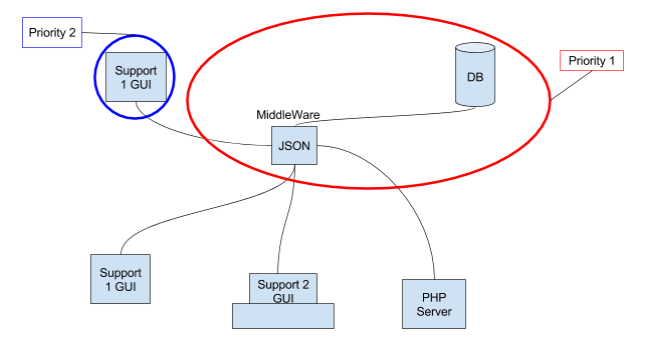

# projectPPE4

Contexte
--------

Cette mission est dédiée au pôle développement du service informatique de l'entreprise "BatDesL".

Problématique
-------------

Le problème est la gestion de l’organisation du service informatique à cause des multiples réunions qui s’enchevêtrent sur l’emploi du temps. Notre équipe a trop de réunions, donc l'emploi du temps "commun" se trouve trop chargé.

Besoins
-------

Liste fonctionnelle :

- Une DataBase (MySQL) sur le serveur du lycée André Malraux
- Un Middleware (traite les données et renvoie un json) qui va récupérer les données de la DataBase puis les présenter pour un affichage sur un support Android.
- Une application GUI (Support Android)
  - Affiche l'heure et la date du jour sur une page d'accueil
  - Affiche l’emploi du temps commun (depuis la BDD)
  - Possibilité de créer des rendez-vous personnalisés

Schéma :

Solution(s)
--------

Notre solution est de réorganiser cet emploi du temps et de créer une application mobile permettant d'afficher celui-ci, grâce à une base de données qui répertorie toutes les réunions.

Critiques
---------
